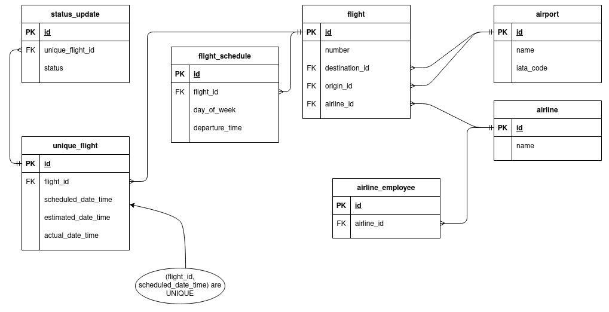
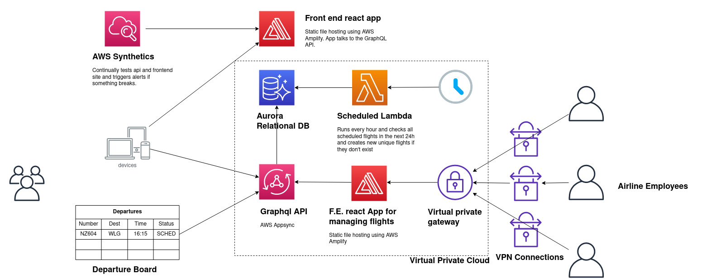

# Xero Flight Board Design

## Overview

- The front end for users to check departures is a statically hosted React app with graphQL.
- There's a publicly available graphql api that can answer queries about departures.
- Airline employees use a vpn to access a different statically hosted management page where they edit flight info. This is also a react app with graphql but it requires users to login so we can set a token with their user id.
  - The graphql api validates the userid belongs to the right airline when editing a flight. 

## Assumptions

- We're ok with using AWS ([because Jeff Bezos hasn't ended world hunger yet](https://twitter.com/HasBezosDecided) and that we can live with some vendor lockin.
- It's ok to use graphql subscriptions to notify users rather than "true" push notifications.
- [AWS site to site VPN](https://docs.aws.amazon.com/vpn/latest/s2svpn/VPC_VPN.html) counts as "not accessible to the internet." Otherwise there's an AWS direct connect service you can use. 
- I don't have to build it all by myself and can have people on the team that know lots about devops / aws. (I'm not an expert)
- Airlines schedule flights in a weekly fashion. The data model can't handle monthly schedules.
- Times are in local time at the departure airport. Time zones are hard and I think this makes sense.
- We don't need historical tables for auditing edits.
- Users can only subscribe to notifications for flights within 24 hours. 
- Airlines can't re-shedule flights that depart in less than 24 hours.

## Data Model

- Airline employees can:
  - Create / edit a `flight`, `flight_schedule`s and `status_update`s
  - A flight can have many schedules.
- A scheduled task runs once / hour that checks all scheduled flights in the next 24 hours and creates entries in the `unique_flight` table.
  - With this design airlines can't post status updates about a flight outside of 24h of departure.
  - There's a `UNIQUE` constraint on the combination of (`flight_id`, `scheduled_departure_date_time`)
- There's an `airline_employee` table which doesn't include all of the actual stuff you need for accounts (password hashes, profiles etc etc.)
- The `airport` table is seeded with all the [iata](https://en.wikipedia.org/wiki/IATA_airport_code) codes for airports.

## System Model

## Estimate

## Deployment

AWS Amplify (static file hosting) is linked with a git repo so it automatically deploys when you merge to master. 

## Development / Testing Environments

Ideally I'd want to use something like [terraform](https://www.terraform.io/) so we could have _infrastructure as code_. This would make it easy to spin up development / testing environments as needed.

## Testing

I'd configure CI and disable merges to master when tests fail.

## Monitoring
