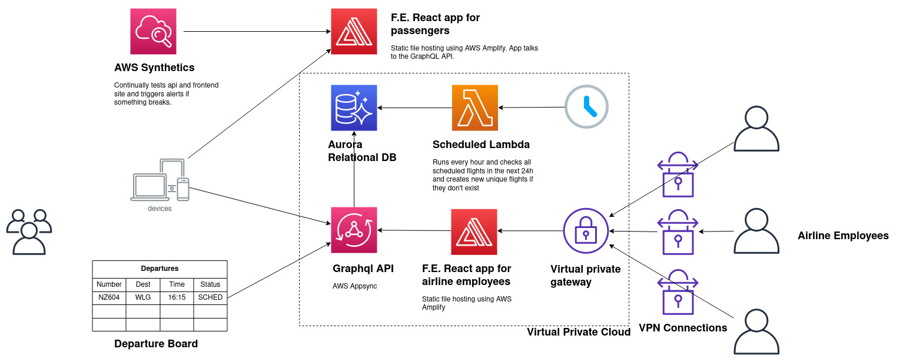

# Xero Flight Board Design

## Overview

- The front end for users to check departures is a statically hosted React app with graphQL.
- There's a publicly available graphql api that can answer queries about departures.
- Airline employees use a vpn to access a different statically hosted management page where they edit flight info. This is also a react app with graphql but it requires users to login so we can set a token with their user id.
  - The graphql api validates the userid belongs to the right airline when editing a flight.

## Assumptions

- We're ok with using AWS 
  - [because Jeff Bezos hasn't ended world hunger yet](https://twitter.com/HasBezosDecided)
  - we can live with some vendor lockin.
- It's ok to use graphql subscriptions to notify users rather than "true" push notifications.
- [AWS site to site VPN](https://docs.aws.amazon.com/vpn/latest/s2svpn/VPC_VPN.html) counts as "not accessible to the internet." Otherwise there's an AWS direct connect service you can use.
- I don't have to build it all by myself and can have people on the team that know lots about devops / aws. (I'm not an expert)
- Airlines schedule flights in a weekly fashion. The data model can't handle monthly schedules.
- Times are in local time at the departure airport. Time zones are hard and I think this makes sense.
- We don't need historical tables for auditing edits.
- Users can only subscribe to notifications for flights within 24 hours.
- Airlines can't re-shedule flights that depart in less than 24 hours.

## Data Model

- Airline employees can:
  - Create / edit a `flight`, `flight_schedule`s and `status_update`s
  - A flight can have many schedules.
- A scheduled task runs once / hour that checks all scheduled flights in the next 24 hours and creates entries in the `unique_flight` table. The times are arbitrary but I'm trying to make it a bit resilient so that if one of the scheduled tasks fails, you have 24 hours tofix it and re-run it.
  - With this design airlines can't post status updates about a flight outside of 24h of departure because the scheduled task won't have created a unique flight yet.
  - There's a `UNIQUE` constraint on the combination of (`flight_id`, `scheduled_date_time`).  
- There's an `airline_employee` table which doesn't include all of the actual stuff you need for accounts (password hashes, profiles etc etc.)
- The `airport` table is seeded with all the [iata](https://en.wikipedia.org/wiki/IATA_airport_code) codes for airports.

## System Model

- The AWS Appsync would use lambda functions for the [resolvers](https://docs.aws.amazon.com/appsync/latest/devguide/tutorials.html). I'd want this so we can support the need to scale up very quickly under heavy load.
- AWS Appsync also has a [cache](https://docs.aws.amazon.com/appsync/latest/devguide/enabling-caching.html) we could configure to further improve performance if we wanted to pay for it.
- We'd need to restrict access to the parts of the api that manage flights. But that seems doable looking at the [docs](https://docs.aws.amazon.com/appsync/latest/devguide/security-authorization-use-cases.html)

## Estimates

Assuming a team of a few back-enders, a few front enders, someone who knows AWS + terraform. Plus associated designers.

- Designing the graphql schema: 1 week. 
- Setting up infrastructure: 2 weeks - 1 month.
- Writing the resolvers: 1-2 weeks.
- Writing the client facing frontend: 1 week
- Writing the airline facing frontend: 1 - 3 months.
- Writing terraforms: ??? 1 month?

Something like this might get you to MVP and then you could keep iterating.

## Deployment

AWS Amplify (static file hosting) links with a git repo so it automatically deploys when you merge to master. 

I'd also want some kind of deployment pipeline for the lambda functions so that tests run and then we do the deploy. I'm out of time though to research how to do it.

## Development / Testing Environments

Ideally I'd want to use something like [terraform](https://www.terraform.io/) so we could have _infrastructure as code_. This would make it easy to spin up development / testing environments as needed.

## Testing

For the front end apps I'd configure CI and disable merges to master when tests fail.

The graphql resolver lambda functions should be written to be testable too. I'd probably use an [onion architecture](https://medium.com/@shivendraodean/software-architecture-the-onion-architecture-1b235bec1dec) so that we could test the domain logic while mocking the infrastructure. This helps mitigate a little of the vendor lock-in risk. If we needed to move away from AWS and lambda functions the application layer and the infrastructure layers might change but the domain wouldn't.

## Monitoring

I really enjoyed learning about monitoring and creating dashboards for my team at Funda. I saw it bring a lot to the team. We did it with datadog but it seems AWS has similar tools. Part of that would be having [AWS synthetic monitoring](https://docs.aws.amazon.com/AmazonCloudWatch/latest/monitoring/CloudWatch_Synthetics_Canaries.html) configured to use the frontend and trigger alerts when stuff breaks. 
